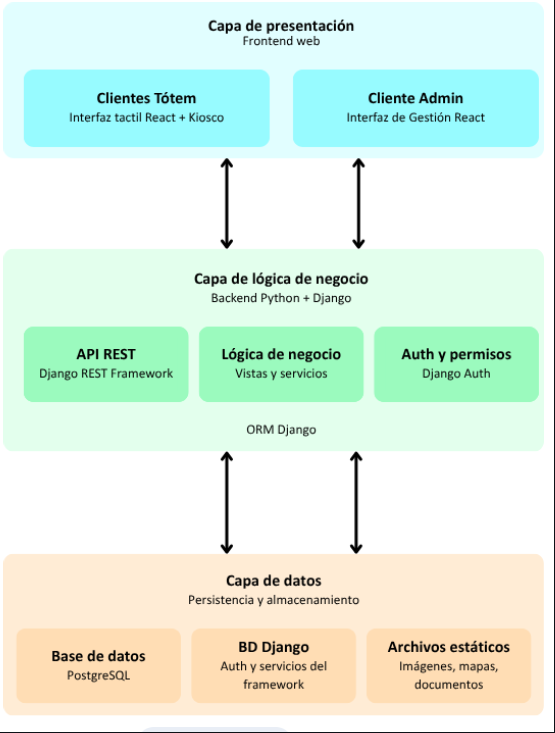

# Sistema de Tótems Interactivos

## Inicio del proyecto

La problemática que da origen al proyecto surge de la necesidad de modernizar y centralizar la comunicación en un entorno de alta concurrencia dentro de la facultad, buscando reducir la falta de información y de orientación para mantener informada tanto a la comunidad universitaria como a los interesados externos que se acercan a la institución.

### Principales problemas detectados

#### Orientación

Para un alumno ingresante es muy común no estar orientado dentro del nuevo ambiente universitario, al igual que para cualquier visitante que se acerca por primera vez a la institución. Estos presentan cierta confusión al momento de localizar aulas, departamentos y oficinas administrativas de la universidad.

#### Comunicación

Los carteles o folletos impresos no permiten la actualización inmediata de información relevante, como alertas de paros docentes, cambios en el calendario académico o noticias urgentes.

#### Datos académicos

La consulta de horarios de cursada y fechas de mesas de exámenes dependen de listas impresas o archivos PDF.

## Descripción del proyecto

La solución consiste en un proyecto que conlleva la implementación de un **Tótem Universitario** que funciona como punto de información digital, táctil y de alta disponibilidad para facilitar el acceso a la información.

### Funcionalidades principales

Este tótem universitario ofrecerá una interfaz interactiva que permite a la comunidad educativa:

- Acceder a un sistema de guía interactivo para la orientación física dentro de la facultad.
- Consultar información referida a la facultad actualizada en el momento.
- Visualizar la difusión de diferentes novedades, noticias y actividades de la institución.
- Acceder a datos académicos específicos (horarios, mesas de examen) por carrera y materia.

## Modalidad de ejecución

El sistema operará dentro de un navegador web, el cual está configurado en **Modo Kiosco**.
Esta configuración tiene como objetivo restringir o bloquear el acceso directo al sistema operativo.

La aplicación implementa la siguiente arquitectura de software:

<p align="center">
  
</p>

## Objetivos principales del proyecto

- Mejorar la experiencia del usuario y la accesibilidad dentro de la facultad mediante la implementación de un sistema de información interactivo.
- Optimizar la gestión y difusión de la información académica a través de la automatización de las publicaciones a la comunidad.
- Garantizar la operatividad y confiabilidad del sistema asegurando su estabilidad, disponibilidad y funcionamiento constante.
- Desarrollar una arquitectura que permite la administración remota y configuraciones personalizadas para múltiples unidades.
- Diseñar una interfaz intuitiva que gestiona la actividad e inactividad de forma eficiente, apta para todo tipo de usuarios.

---

## Puesta en marcha con Docker

### 1. Requisitos previos
- [Docker](https://docs.docker.com/get-docker/) con Docker Compose incluido (`docker compose version`).
- Puertos `5173`, `8000` y `5432` disponibles.

### 2. Configuración inicial
Desde la raíz del repositorio:
```bash
cp .env.example .env
```
Editar `.env`. Como mínimo, definir una contraseña segura en `DB_PASSWORD` y una clave en `SECRET_KEY` (mantener `DB_HOST=db` para Compose).

Variables principales:

| Variable | Uso | Valor por defecto / Ejemplo |
| :--- | :--- | :--- |
| `DB_NAME` | Base PostgreSQL | `totem_db` |
| `DB_USER` | Usuario PostgreSQL | `postgres` |
| `DB_PASSWORD` | Contraseña PostgreSQL | *definir clave* |
| `DB_HOST` | Host dentro de Compose | `db` |
| `DB_PORT` | Puerto PostgreSQL | `5432` |
| `SECRET_KEY` | Clave secreta de Django | *clave aleatoria* |
| `DEBUG` | Modo desarrollo | `True` |
| `VITE_API_URL` | URL de la API consumida por el front | `http://localhost:8000/api` |

### 3. Arranque y creación del administrador
```bash
# Construir e iniciar contenedores en segundo plano
docker compose up -d --build

# Verificar que los servicios estén activos
docker compose ps

# Crear el primer usuario administrador
docker compose exec backend python manage.py createsuperuser
```

Para detener o reiniciar el entorno conservando los datos:
```bash
docker compose down
docker compose up -d
```

> [!TIP]
> Si prefieres ejecutar el proyecto de forma nativa sin Docker, consulta la [Guía de Instalación y Ejecución Local](docs/instalacion-local.md).

---

## Acceso al sistema

| Servicio | URL | Descripción |
| :--- | :--- | :--- |
| **Frontend (Tótem / Kiosco)** | http://localhost:5173 | Pantalla pública táctil del tótem. |
| **Panel Administrativo Web** | http://localhost:5173/admin/ | Gestión de tótems, plantillas, horarios y noticias. |
| **Django Admin** | http://localhost:8000/admin/ | Administración avanzada del backend e importación masiva. |
| **API REST** | http://localhost:8000/api/ | Endpoints del backend. |

---

## Configurar y vincular un tótem

1. Abrir la raíz del frontend en `http://localhost:5173/`. Si el dispositivo no está vinculado, mostrará un **código de emparejamiento temporal** de 5 dígitos.
2. Ingresar al panel administrativo en `http://localhost:5173/admin/` con el superusuario creado.
3. Ir a **Tótems > Registrar nuevo tótem** e ingresar el código mostrado en la pantalla.
4. Crear una **Plantilla** seleccionando los widgets deseados y definiendo su posición en la cuadrícula.
5. Asociar la plantilla al tótem vinculado.
6. Cargar el contenido desde las secciones del panel (horarios, avisos, eventos, noticias).
7. La pantalla del tótem se actualizará automáticamente en tiempo real reflejando los cambios.

---

## Operación y diagnóstico

- Consultar logs de los servicios: `docker compose logs -f backend`, `docker compose logs -f frontend` o `docker compose logs -f db`.
- Si se modifican modelos o migraciones, reconstruir con `docker compose up -d --build`.

---

## Documentación del proyecto

Para consultar guías técnicas y operativas detalladas, revisar los documentos en la carpeta [`docs/`](docs/):

- [Arquitectura y Configuración](docs/arquitectura-y-configuracion.md): Stack técnico, capas, Docker y variables.
- [Catálogo de Endpoints de la API](docs/api-endpoints.md): Referencia rápida en tablas de rutas REST y WebSockets.
- [Modelos de Base de Datos](docs/modelos-base-de-datos.md): Esquema relacional y Diagrama Entidad-Relación (DER).
- [Guía de Carga de Datos CSV](docs/carga-datos-csv.md): Preparación en Excel y carga masiva en el sistema.
- [Guía de Modo Kiosco](docs/modo-kiosco.md): Configuración de computadoras (Windows y Linux) para pantallas táctiles.
- [Guía de Instalación Local](docs/instalacion-local.md): Ejecución alternativa paso a paso sin Docker.
