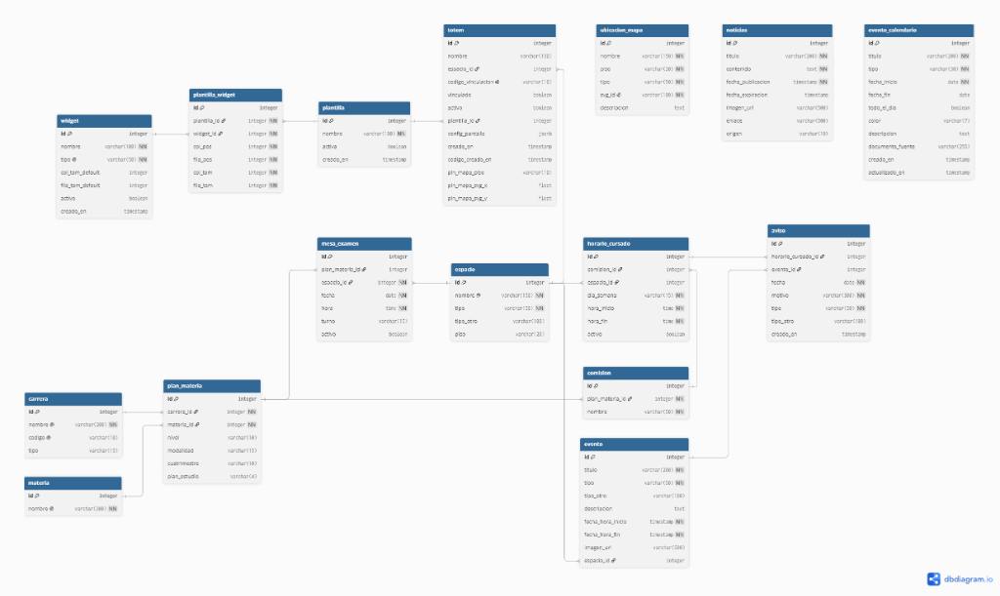

# Modelos de Base de Datos - STU-FRRe

Este documento describe la estructura del modelo relacional implementado en PostgreSQL a través del ORM de Django para el proyecto **STU-FRRe**. Se detallan todas las entidades, sus campos, tipos de datos, relaciones de clave foránea y restricciones de integridad.

---

## 1. Diagrama Entidad-Relación (DER)

> Código fuente del esquema disponible en [database.dbml](database.dbml) para editar o visualizar en [dbdiagram.io](https://dbdiagram.io).

---

## 2. Módulo Académico

### 2.1. Carrera (`api_carrera`)
Representa una oferta académica de la institución (grado, tecnicatura, posgrado).
- `id` (AutoField, PK)
- `nombre` (CharField 200, Unique): Nombre completo de la carrera (ej: *Ingeniería en Sistemas de Información*).
- `codigo` (CharField 10, Unique, Nullable): Código o sigla (ej: `ISI`, `IEM`, `IQ`).
- `tipo` (CharField 15): Opciones: `grado`, `tecnica`, `posgrado`, `diplomatura`.

### 2.2. Materia (`api_materia`)
Almacena el nombre unívoco de cada asignatura con independencia del plan en el que se dicte.
- `id` (AutoField, PK)
- `nombre` (CharField 200, Unique): Nombre oficial de la materia.

### 2.3. PlanMateria (`api_planmateria`)
Tabla intermedia de asociación curricular. Define cómo se dicta una materia dentro de una carrera y un plan específico.
- `id` (AutoField, PK)
- `carrera_id` (ForeignKey -> Carrera, `on_delete=PROTECT`)
- `materia_id` (ForeignKey -> Materia, `on_delete=PROTECT`)
- `nivel` (CharField 10): Año de cursado: `primero`, `segundo`, `tercero`, `cuarto`, `quinto`.
- `modalidad` (CharField 15): `anual` o `cuatrimestral`.
- `cuatrimestre` (CharField 10, Nullable): `primero` o `segundo` (obligatorio si modalidad es cuatrimestral).
- `plan_estudio` (CharField 4): `2023`, `2008`.
- **Restricción de unicidad:** `unique_together = ['carrera', 'materia', 'nivel', 'plan_estudio']`.

### 2.4. Comision (`api_comision`)
Cursos o divisiones abiertas para cursar una materia en un determinado plan.
- `id` (AutoField, PK)
- `plan_materia_id` (ForeignKey -> PlanMateria, `on_delete=CASCADE`)
- `nombre` (CharField 50): Código de la comisión (ej: `1K01`, `2K02`, `Única`).
- **Restricción de unicidad:** `unique_together = ['plan_materia', 'nombre']`.

### 2.5. HorarioCursado (`api_horariocursado`)
Franjas horarias y días asignados a cada comisión en un espacio físico.
- `id` (AutoField, PK)
- `comision_id` (ForeignKey -> Comision, `on_delete=CASCADE`, Nullable)
- `espacio_id` (ForeignKey -> Espacio, `on_delete=CASCADE`, Nullable)
- `dia_semana` (CharField 15): `lunes`, `martes`, `miercoles`, `jueves`, `viernes`, `sabado`.
- `hora_inicio` (TimeField): Hora inicial del bloque (formato `HH:MM`).
- `hora_fin` (TimeField): Hora de culminación del bloque.
- `activo` (BooleanField, default=True): Estado de vigencia de la cursada.
- **Restricción de unicidad:** `unique_together = ['comision', 'espacio', 'dia_semana', 'hora_inicio', 'hora_fin']`.

### 2.6. MesaExamen (`api_mesaexamen`)
Instancias de exámenes finales por asignatura, turno y fecha.
- `id` (AutoField, PK)
- `plan_materia_id` (ForeignKey -> PlanMateria, `on_delete=CASCADE`, Nullable)
- `espacio_id` (ForeignKey -> Espacio, `on_delete=CASCADE`)
- `fecha` (DateField): Fecha del examen.
- `hora` (TimeField): Hora de inicio de la mesa.
- `turno` (CharField 15): Meses: `febrero`, `marzo`, `abril`, `junio`, `agosto`, `septiembre`, `octubre`, `diciembre`.
- `activo` (BooleanField, default=True)
- **Propiedades calculadas:**
  - `llamado`: Devuelve el número correlativo de llamado (1 al 8) según el turno.
  - `dia_semana`: Devuelve el nombre del día de la semana correspondiente a la fecha.
- **Restricción de unicidad:** `unique_together = ['plan_materia', 'espacio', 'fecha', 'hora', 'turno']`.

---

## 3. Módulo de Ubicaciones

### 3.1. Espacio (`api_espacio`)
Instalaciones físicas del predio universitario (aulas, laboratorios, oficinas).
- `id` (AutoField, PK)
- `nombre` (CharField 150, Unique): Nombre del espacio (ej: *Aula Magna*, *Aula 101*).
- `tipo` (CharField 50): `aula`, `laboratorio_informatico`, `secretaria`, `departamento`, `otro`.
- `tipo_otro` (CharField 100, Blank): Aclaración obligatoria cuando `tipo='otro'`.
- `piso` (CharField 20): `planta_baja`, `primer_piso`, `segundo_piso`.

### 3.2. UbicacionMapa (`api_ubicacionmapa`)
Polígonos interactivos representados sobre el SVG del mapa del tótem.
- `id` (AutoField, PK)
- `nombre` (CharField 150): Nombre visible al hacer clic o buscar.
- `piso` (CharField 20): `planta_baja`, `primer_piso`, `segundo_piso`.
- `tipo` (CharField 50): `aula`, `oficina`, `departamento`, `secretaria`, `laboratorio`, `servicio`, `escaleras`, `ascensor`.
- `svg_id` (CharField 100, Unique): Identificador del elemento `<path>` o `<polygon>` dentro del archivo vectorial SVG.
- `descripcion` (TextField, Blank)

---

## 4. Módulo de Configuración y Tótems

### 4.1. Totem (`api_totem`)
Dispositivos físicos registrados en la facultad.
- `id` (AutoField, PK)
- `nombre` (CharField 150, Blank): Nombre descriptivo (ej: *Tótem Entrada Principal*).
- `espacio_id` (ForeignKey -> Espacio, `on_delete=PROTECT`, Nullable)
- `codigo_vinculacion` (CharField 10, Unique, Nullable): Código de 5 dígitos temporales (`pairing code`).
- `vinculado` (BooleanField, default=False): Indica si ya fue enlazado con éxito.
- `activo` (BooleanField, default=True)
- `plantilla_id` (ForeignKey -> Plantilla, `on_delete=SET_NULL`, Nullable)
- `config_pantalla` (JSONField): Opciones de configuración visual (resolución, brillo, orientación).
- `pin_mapa_piso`, `pin_mapa_svg_x`, `pin_mapa_svg_y`: Coordenadas de geolocalización del tótem en el plano para indicar "Usted está aquí".

### 4.2. Widget (`api_widget`)
Componentes visuales disponibles para ubicar en las pantallas.
- `id` (AutoField, PK)
- `nombre` (CharField 100): Nombre legible (ej: *Horarios de Hoy*, *Noticias*, *Clima*).
- `tipo` (CharField 50, Unique): Clave unívoca del widget (ej: `horarios`, `examenes`, `noticias`, `avisos`, `calendario`, `mapa`).
- `col_tam_default` (PositiveIntegerField): Ancho base en columnas del grid.
- `fila_tam_default` (PositiveIntegerField): Alto base en filas del grid.
- `activo` (BooleanField, default=True)

### 4.3. Plantilla (`api_plantilla`)
Conjuntos de distribución de widgets aplicables a uno o más tótems.
- `id` (AutoField, PK)
- `nombre` (CharField 100)
- `activa` (BooleanField, default=True)

### 4.4. PlantillaWidget (`api_plantillawidget`)
Tabla de posición y tamaño de un widget dentro de una plantilla específica (CSS Grid).
- `id` (AutoField, PK)
- `plantilla_id` (ForeignKey -> Plantilla, `on_delete=CASCADE`)
- `widget_id` (ForeignKey -> Widget, `on_delete=CASCADE`)
- `col_pos` (PositiveIntegerField): Posición de inicio horizontal (columna).
- `fila_pos` (PositiveIntegerField): Posición de inicio vertical (fila).
- `col_tam` (PositiveIntegerField): Span de columnas.
- `fila_tam` (PositiveIntegerField): Span de filas.

---

## 5. Módulo de Eventos, Comunicación y Calendario

### 5.1. Evento (`api_evento`)
Actividades extracurriculares, charlas, cursos o jornadas institucionales.
- `id` (AutoField, PK)
- `titulo` (CharField 200)
- `tipo` (CharField 50): `taller`, `curso`, `recreativo`, `charla`, `otro`.
- `fecha_hora_inicio`, `fecha_hora_fin` (DateTimeField)
- `imagen_url` (CharField 500, Blank)
- `espacio_id` (ForeignKey -> Espacio, `on_delete=CASCADE`, Nullable)

### 5.2. Aviso (`api_aviso`)
Alertas temporales o suspensiones que impactan sobre horarios o eventos (ej: paros, inasistencias docentes, feriados).
- `id` (AutoField, PK)
- `horario_cursado_id` (ForeignKey -> HorarioCursado, `on_delete=CASCADE`, Nullable)
- `evento_id` (ForeignKey -> Evento, `on_delete=CASCADE`, Nullable)
- `fecha` (DateField)
- `motivo` (CharField 300)
- `tipo` (CharField 50): `paro`, `inasistencia`, `feriado`, `otro`.
- **Validación del modelo:** Debe asociarse obligatoriamente al menos a un `horario_cursado` o a un `evento`.

### 5.3. Noticias (`api_noticias`)
Artículos y novedades de difusión institucional.
- `id` (AutoField, PK)
- `titulo` (CharField 200)
- `contenido` (TextField)
- `fecha_publicacion` (DateTimeField)
- `fecha_expiracion` (DateTimeField, Nullable)
- `imagen_url` (URLField 500, Blank)
- `enlace` (URLField 500, Blank): Link a la noticia completa o fuente externa.
- `origen` (CharField 10): `manual` (cargada por admin) o `scraping` (obtenida automáticamente de la web).

### 5.4. EventoCalendario (`api_eventocalendario`)
Hitos del calendario académico general (comienzo/fin de cuatrimestres, receso, feriados).
- `id` (AutoField, PK)
- `titulo` (CharField 200)
- `tipo` (CharField 30): `inicio_cuatrimestre`, `fin_cuatrimestre`, `mesa_examen`, `receso_invernal`, `feriado`, `otro`.
- `fecha_inicio` (DateField)
- `fecha_fin` (DateField, Nullable): Permite definir eventos que abarcan rangos de días.
- `todo_el_dia` (BooleanField, default=True)
- `color` (CharField 7, Blank): Código hexadecimal de color para la visualización en el calendario.
- `documento_fuente` (FileField): Archivo adjunto oficial (resolución o PDF del calendario).
